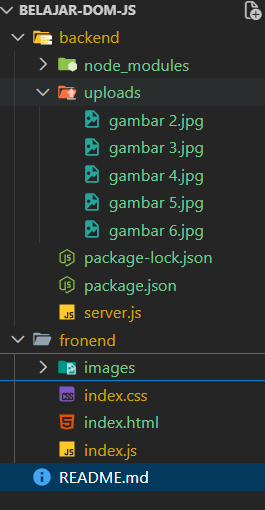

# 📷 Photo Gallery Upload

Aplikasi web sederhana untuk menampilkan galeri foto, upload foto, dan menghapus foto menggunakan Node.js, Express, dan Multer.
Frontend mengambil data gambar langsung dari backend.

---

## 🚀 Fitur

- Menampilkan gambar dari server

- Upload foto ke server

- Menghapus foto dari server

- Klik thumbnail untuk mengganti gambar utama

- Layout responsive

- Menggunakan Fetch API

---

## 🛠 Teknologi yang Digunakan

- Node.js

- Express.js

- Multer (upload file)

- JavaScript DOM

- HTML

- CSS

---

## 📁 Struktur Folder



---

## Clone Project

```text
git clone https://github.com/silaban13/BELAJAR-DOM-JS.git
cd BELAJAR-DOM-JS

```

---

## Install Dependency

```text
cd backend
npm install
express
multer
cors